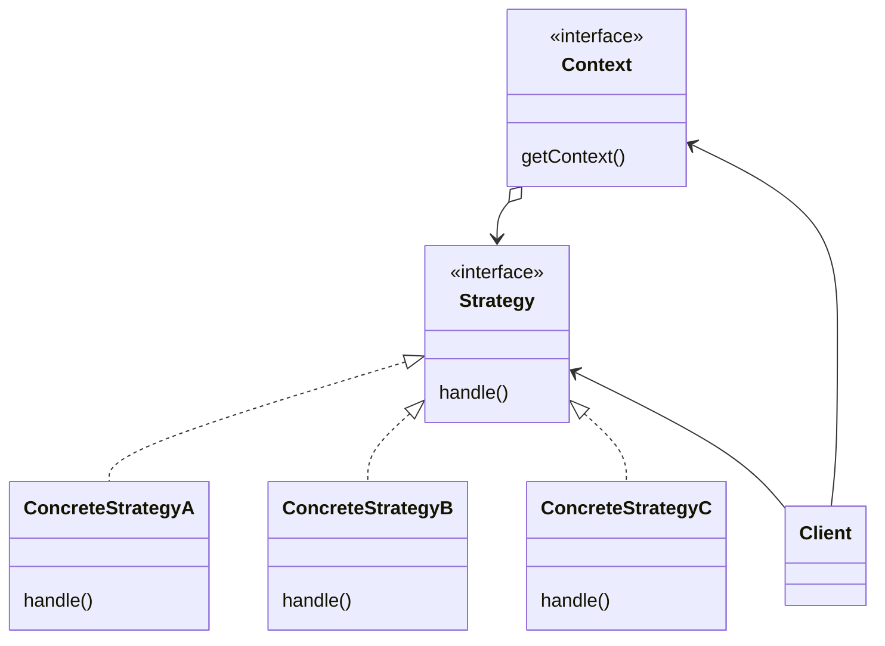

# 模式描述

策略模式（Strategy）定义了一系列行为，将每个行为分别封装起来，让它们可以互相替换，使得行为的变化可以独立于使用它们的客户端。

# 优点

1. 提供了一组 Strategy；
2. 组合代替了继承；
3. 消除分支；
4. client 选择 Strategy 实现；

# 缺点

1. client 需要了解 Strategy 实现的不同；
2. 某些 Strategy 用不到所有 Context 传来的数据，增加通信成本；
3. 增加了类的数目；

# 应用场景

1. 替换的仅仅是类中的行为；
2. 行为中的数据对用户是隐藏的；

<!-- more -->

|     DATE      |    CHANGELOG     |
| :-----------: | :--------------: |
| 2023年4月25日 |      初始化      |
| 2023年4月30日 | 添加 Go 语言实现 |

# UML 类图

# 参与者

## Context 接口

- 提供一个方法来配置自身；

- 维护对 Strategy 的引用；

## Strategy 接口

支持行为的公共接口。Context 使用 Strategy 提供的方法来调用某个 ConcreteStrategyX。

## ConcreteStrategyX类

具体实现 Strategy 接口。

## Client 类

客户端。

# 数据流

1. client 通常创建 ConcreteStrategyX 对象交给 Context 接收，这样 client 仅与 Context 进行交互；
2. 当 client 调用时，Context 将 Strategy 所需的数据传递给 ConcreteStrategyX，处理完成后回调给 Context;

# 相关模式

- 享元模式（Flyweight）：Strategy 对象是很好的轻量级对象。

# 补充

- Strategy 可以通过工厂模式来创建。

- ConcreteStrategy 一般是无状态的，是纯粹的算法实现。可以将 ConcreteStrategy 对象缓存到工厂类中，不需要每次调用时创建；如果是有状态的，则需要新创建对象。
- 配置文件或注解指定 ConcreteStrategy 族，StrategyFactory 加载 ConcreteStrategy 族，使用反射在运行时动态决定 ConcreteStrategy 是最典型的用法。

# 示例代码

[golang](https://github.com/hanzhang2566/design-patterns-examples/blob/main/go-patterns/behavioral/strategy/strategy_test.go)

[java](https://github.com/hanzhang2566/design-patterns-examples/blob/main/java-patterns/src/test/java/behavioral/strategy/ClientTest.java)
