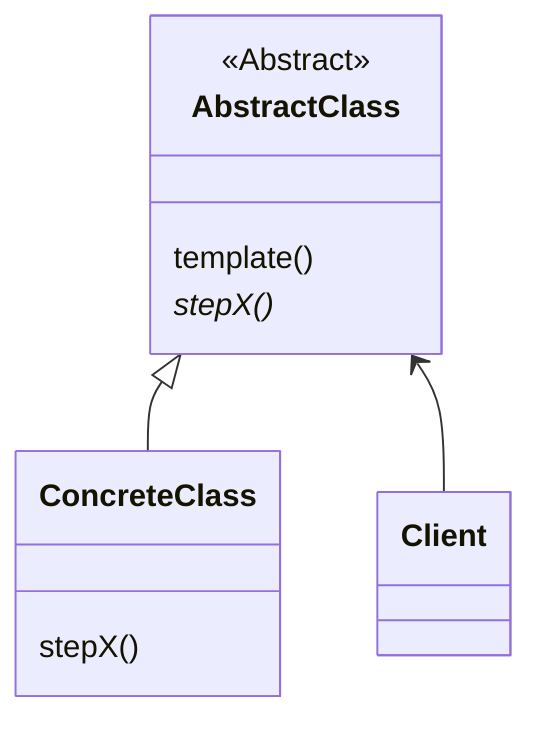

# 模式描述

模板方法(Template Method)模式，定义一个操作中的算法的骨架，而将一些步骤延迟到子类中。模板方法使得子类可以不改变一个算法的结构即可重新定义该算法的某些特定步骤。

# 优点

1. 实现了反转控制；
1. 给子类提供了扩展的钩子 hook；

# 缺点

# 应用场景

1. 实现算法不变的部分，将可变行为留给子类来实现；
1. 子类中公共的行为被提取到父类，避免代码重复；
1. 限制子类扩展

<!-- more -->

|     DATE      |    CHANGELOG     |
| :-----------: | :--------------: |
| 2023年4月29日 |      初始化      |
| 2023年5月1日  | 添加 Go 语言实现 |

# UML 类图

# 参与者

## AbstractClass

- 定义算法骨架，将具体步骤留到子类；

## ConcreteClass

- 继承 AbstractClass，实现具体步骤；

## Client 类

客户端。

# 数据流

1. client 通常使用 AbstractClass 引用来创建一个 ConcreteClass 实例；
1. client 调用 AbstractClass 中的 template 方法；

# 相关模式

- 工厂方法：常被模板方法调用；
- 策略模式：模板方法使用继承来改变算法的一部分；但策略模式是使用委托来改变整个算法；

# 补充

- 模板方法模式通过把不变行为搬移到超类，子类只用实现自己的逻辑来达到代码复用。

# 示例代码

[golang](https://github.com/hanzhang2566/design-patterns-examples/blob/main/go-patterns/behavioral/template/template_test.go)

[java](https://github.com/hanzhang2566/design-patterns-examples/blob/main/java-patterns/src/test/java/behavioral/template/ClientTest.java)
