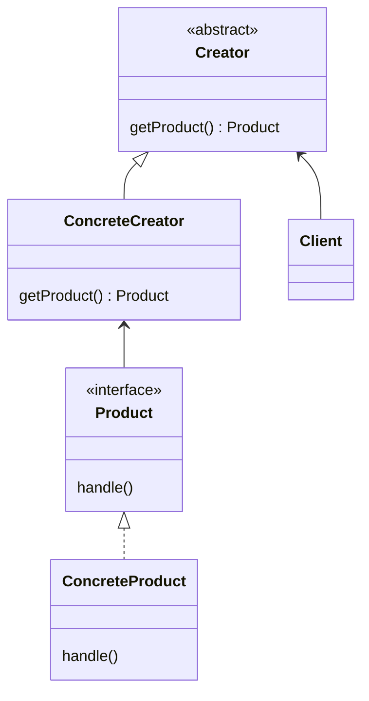

# 模式描述

工厂方法模式(Factory Method)，定义一个用于创建对象的接口，让子类决定实例化哪一个类，使得一个类的实例化延迟到其子类。

# 优点

1. 给子类创建对象预留扩展点；
1. client 通过 Creator 间接创建对象；

# 缺点

1. Creator 实现变多；

# 应用场景

1. 一个类希望由它的子类来创建对象时；
2. 一个类不知道创建对象的类时；

<!-- more -->

|     DATE      |    CHANGELOG     |
| :-----------: | :--------------: |
| 2023年4月24日 |      初始化      |
| 2023年4月30日 | 添加 Go 语言实现 |

# UML 类图

# 参与者

## Product 接口

- 定义工厂方法创建对象的接口。

## ConcreteProduct 类

- Produce 接口的实现。

## Creator 抽象类

- 声明一个抽象工厂方法，返回默认的 Product 对象。

## ConcreteCreator 类

- Creator 抽象类的实现，返回自定义 Product 对象。

## Client 类

- 使用客户端。

# 数据流

1. client 创建一个 Creator；
1. client 调用 Creator 提供的方法来返回 ConcreteProduct。

# 相关模式

- 抽象工厂模式（Abstract Factory）经常用工厂方法实现；
- 工厂方法通常在模板方法中被调用；

# 补充

- 基本的工厂方法中，一个 ConcreteProduct 对应一个 ConcreteCreator 的具体实现；
- 可以通过参数化的方式，来将 ConcreteProduct 分类；

# 示例代码

[golang](https://github.com/hanzhang2566/design-patterns-examples/blob/main/go-patterns/creational/factory/tmpl/factory_tmpl_test.go)

[java](https://github.com/hanzhang2566/design-patterns-examples/blob/main/java-patterns/src/test/java/creational/factory/tmpl/ClientTest.java)
