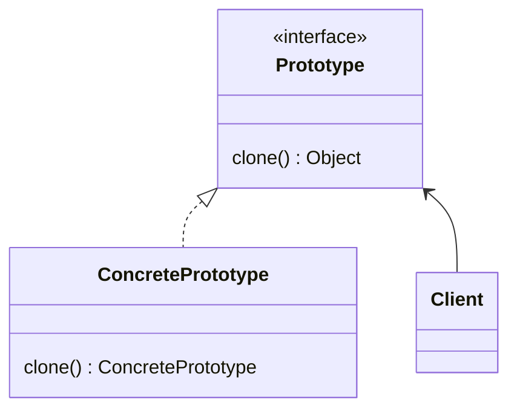

# 模式描述

原型模式是从一个原型实例中创建另外一个相同对象，而不用知道创建细节。。

# 优点

1. 运行时增加和删除对象；
2. 通过极少改变，创建新对象；

# 缺点

1. 要使用深拷贝代替浅拷贝。循环依赖的问题可能使 clone 难以实现；
2. Prototype 的每个子类都要实现 clone；

# 应用场景

- 对象创建的数据需要从 RPC、网络、数据库、文件系统等非常慢速的 IO 中读取；
- 对象创建成本大、不同对象大部分字段都相同。

<!-- more -->

|     DATE      |    CHANGELOG     |
| :-----------: | :--------------: |
| 2023年4月26日 |      初始化      |
| 2023年4月30日 | 添加 Go 语言实现 |

# UML 类图

# 参与者

## Prototype 接口

- 声明一个克隆自身的接口。

## ConcretePrototype 类

- Prototype 接口的实现。

## Client 类

- 客户端用来克隆自身

# 相关模式

- 与抽象工厂（Abstract Factory）亦敌亦友；

# 补充

1. 使用深拷贝，除非有足够的理由才能选择浅拷贝；

# 示例代码

[golang](https://github.com/hanzhang2566/design-patterns-examples/blob/main/go-patterns/creational/prototype/prototype_test.go)

[java](https://github.com/hanzhang2566/design-patterns-examples/blob/main/java-patterns/src/test/java/creational/prototype/ClientTest.java)
