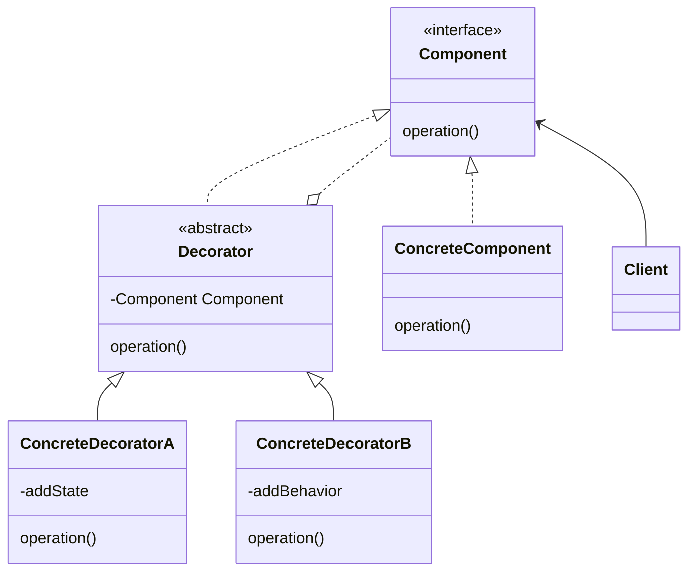

# 模式描述

装饰模式(Decorator)，动态地给一个对象添加一些额外的职责，装饰模式比生成子类更加灵活。

# 优点

1. 比静态的继承更加灵活；
1. 避免高层接口的功能太复杂。

# 缺点

1. 有很多小对象；

# 应用场景

1. 不影响其他对象的情况下，以动态、透明的方式给单个对象添加职责；
1. 不能使用子类扩充功能时；
1. 撤销对象功能；

<!-- more -->

|     DATE      |    CHANGELOG     |
| :-----------: | :--------------: |
| 2023年4月27日 |      初始化      |
| 2023年4月30日 | 添加 Go 语言实现 |

# UML 类图

# 参与者

## Component 接口

- 定义方法，能够动态地添加职责。

## ConcreteComponent 类

- Component 接口的实现，有基础的功能。

## Decorator 抽象类

- 实现 Component 接口，并组合一个 Component 对象。

## ConcreteDecoratorX 类

- 继承 Decorator 抽象类，用来添加职责。

## Client 类

- 客户端

# 数据流

1. client 创建一个 Component；
1. 通过 Decorator 层层包装 client；
1. 调用 Component 提供的方法进行工作；

# 相关模式

- 适配器模式：装饰者模式仅改变对象职责，而适配器模式将给对象一个全新的接口；
- 组合模式：装饰器模式被认为是退化为只有一个组件的组合；
- 策略模式：装饰器模式改变的是对象外表，而策略模式改变对象内核。

# 补充

- 装饰模式使得核心职责和装饰功能区分开，减少重复的装饰逻辑；

# 示例代码

[golang](https://github.com/hanzhang2566/design-patterns-examples/blob/main/go-patterns/structural/decorator/decorator_test.go)

[java](https://github.com/hanzhang2566/design-patterns-examples/blob/main/java-patterns/src/test/java/structural/decorator/ClientTest.java)
