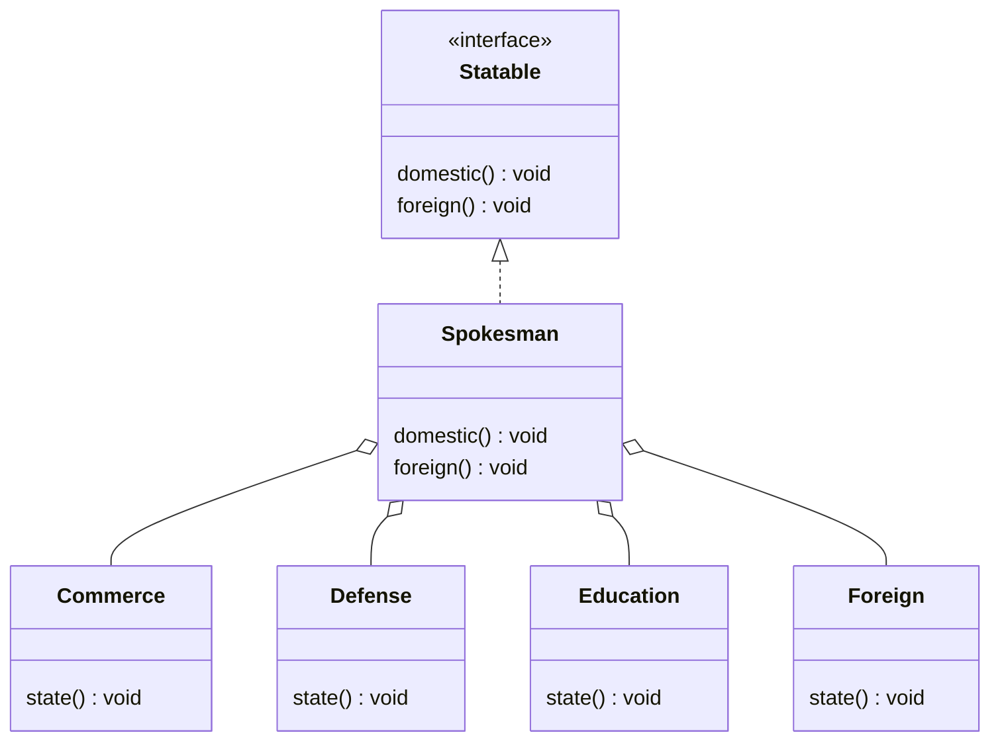

# 模式描述

门面模式(Facade)模式，为子系统提供一组统一的接口，定义一组高层接口让子系统更易用，这个接口使得子系统更容易使用。

# 优点

1. 

# 缺点

1. 

# 应用场景

1. 解决易用性问题。例如 Linux 系统提供的系统调用函数等；
1. 解决性能问题。
1. 解决分布式事务问题。

<!-- more -->

|     DATE      |    CHANGELOG     |
| :-----------: | :--------------: |
| 2023年4月30日 |      初始化      |
| 2023年5月1日  | 添加 Go 语言实现 |

# UML 类图

# 参与者

## Client 类

- 客户端

# 数据流

1. client 创建一个 Component；
1. 通过 Decorator 层层包装 client；
1. 调用 Component 提供的方法进行工作；

# 相关模式

- 抽象工厂：

# 补充

- 门面模式是通过门面接口提供了对封装底层组合功能的封装。

# 示例代码

[golang](https://github.com/hanzhang2566/design-patterns-examples/blob/main/go-patterns/structural/facade/facade_test.go)

[java](https://github.com/hanzhang2566/design-patterns-examples/blob/main/java-patterns/src/test/java/structural/facade/ClientTest.java)
