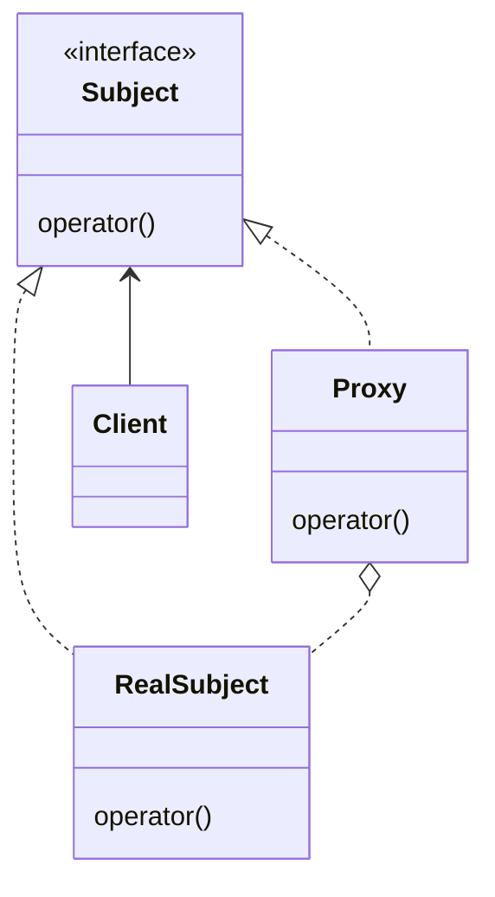

# 模式描述

不改变原始类（或叫被代理类）代码的情况下，通过引入代理类来控制这个对象的访问。

# 优点

- 间接访问原始类；

# 缺点

- 编写的目标代理类太多，当代理类接口改变，所有的代理类都需要进行更新。

# 应用场景

1. 业务系统的非功能性需求开发。监控、统计、鉴权、限流、事务、幂等、日志。

1. RPC

1. 缓存

<!-- more -->

|     DATE      |    CHANGELOG     |
| :-----------: | :--------------: |
| 2023年4月27日 |      初始化      |
| 2023年5月1日  | 添加 Go 语言实现 |

# UML 类图

# 参与者

## Subject 接口

- 定义 Proxy 和 RealSubject 的方法，使得任何使用 RealSubject 的地方可以被 proxy 代替；

## Proxy 类

- 代理类。

## RealSubject 类

- 被代理类

## Client 类

- 客户端

# 数据流

1. client 创建一个 Proxy ；
1. 通过 Proxy 代理类访问原始类；

# 相关模式

- 适配器模式：适配器模式将给对象一个全新的接口，而代理模式使用相同接口；
- 装饰模式：装饰模式是给原始类增加功能，而代理关注访问和控制原始类；

# 补充

- 使用反射可以完成原始类的动态代理。
- 原始类能够定义接口，一般都是采用实现接口的方式。例如，Spring AOP。
- 原始类没有定义接口，也没办法给原始类重新定义接口，一般都是采用继承的方式实现代理。例如，cglib。

# 示例代码

[golang](https://github.com/hanzhang2566/design-patterns-examples/blob/main/go-patterns/structural/proxy/proxy_test.go)

[java](https://github.com/hanzhang2566/design-patterns-examples/blob/main/java-patterns/src/test/java/structural/proxy/ClientTest.java)
