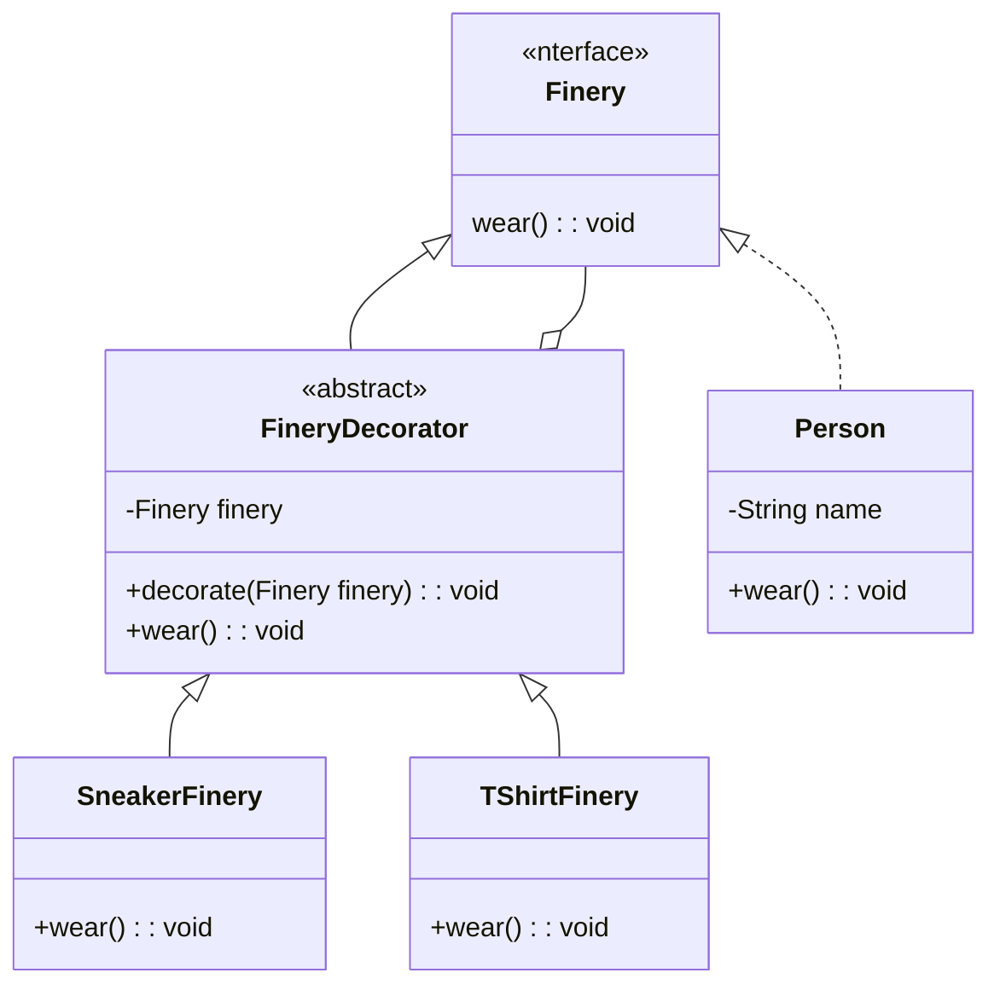

# 模式描述

> 装饰模式(Decorator)，动态地给一个对象添加一些额外的职责，就增加功能来说，装饰模式比生成子类更为灵活。

# 需求

装饰模式实现给 Person 动态进行穿衣打扮。

# UML 类图

# 特点

1. 装饰器类 `FineryDecorator` 和原始类 `Person` 继承同样的父类 Finery，可以对原始类“嵌套”多个装饰器；
2. 装饰器类 `FineryDecorator` 是对原始类 `Person` 功能的增强；
3. 通过组合代替继承，解决继承关系过于复杂。把原有类中的装饰功能移除，简化原有类；
4. 把类的核心职责和装饰功能区分开，减少重复的装饰逻辑；

# 最佳实践

# 对比

代理类附加的是跟原始类无关的功能，而在装饰器模式中，装饰器类附加的是跟原始类相关的增强功能。
